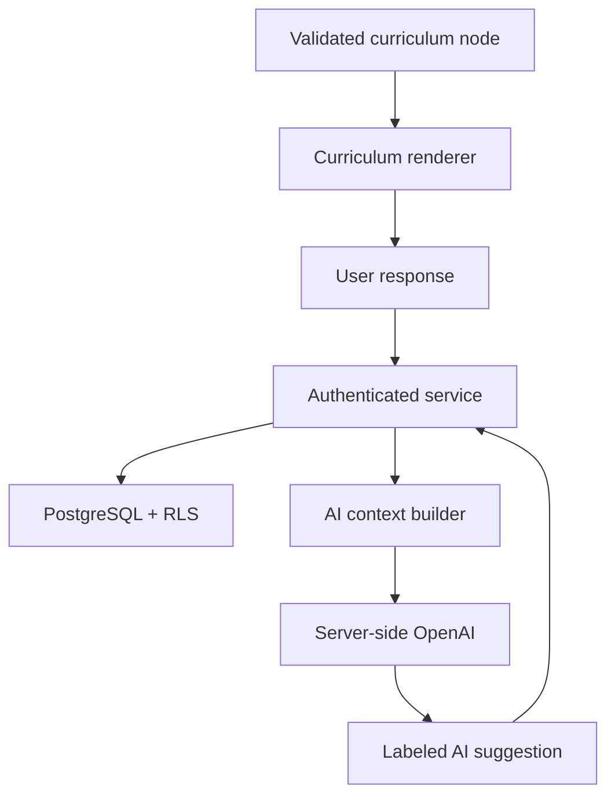

# RTS Phase 1 Vertical Slice Design

## Intent

Build one controlled prototype that proves RTS can move a person from noticing a real-life moment through careful interpretation and a live practice, preserve their exact wording, support optional bounded AI reflection, survive leaving and returning, and maintain trustworthy privacy and provenance. It must feel like the Overview site translated into an application, not like an LMS or chat product.

## Controlling boundaries

- Journey: Awaken → See Clearly → Become → Join.
- Slice curriculum: Awaken Pay Attention, one See Clearly bridge, one Become bridge and return workflow.
- AI modes supported architecturally: Explain, Reflect, Guide Me, Route. The demonstrated slice uses Reflect and selected-entry context.
- User wording, structured formation data, AI-derived data, curriculum progress, and formation evidence are separate.
- No spiritual score, diagnostic inference, divine-direction claim, calling assignment, forced reconciliation, or unsafe passivity.
- No full curriculum build or deferred features.

## User flow

1. Create account or sign in.
2. See Awaken as current stage, a Resume action, and no fabricated maturity indicator.
3. Open Pay Attention from structured curriculum content.
4. Save what happened, what happened inside, and a body cue as exact user wording plus appropriate structured records.
5. Open Reflect. The server sends current curriculum context and current entry only. AI asks one precise non-diagnostic question.
6. Choose whether to save an added insight. Unsaved AI text is not formation data.
7. Enter See Clearly and separate observable fact from interpretation; record one belief or expectation.
8. Enter Become and record the outcome being controlled, what is true now, and the next right step.
9. Save an open practice in `waiting_for_real_life`.
10. Leave/sign out. On return, the dashboard surfaces the same unfinished practice and curriculum resume pointer.
11. Record what happened, review it, and close the practice.
12. Open Formation History and see exact user wording, structured records, and AI-derived items in separate labeled regions.
13. Grant AI access to one selected prior entry and run Reflect; the server proves the grant before assembling context.
14. Revoke the grant and prove future context assembly excludes the entry.
15. Delete the source entry; dependent AI artifacts are hard-deleted and curriculum state remains.

No full AI transcript is stored during this flow. Explicitly saved AI-derived material is an artifact with normalized source dependencies; a new insight written by the user remains user-authored wording with visible lineage.

## Component model

- `AppShell`: Tree of Life branding, current stage, account controls, accessible navigation.
- `Dashboard`: Resume and unfinished-practice regions with editorial hierarchy.
- `CurriculumRenderer`: renders validated interaction definitions.
- `Teaching`, `Scripture`, `Prompt`, `StructuredInput`, `Bridge`, `Practice`, `Return`, and `Review` renderers.
- `AIReflectPanel`: optional, contextual, clearly non-authoritative, with explicit save affordance.
- `HistoryTimeline`: groups linked records without merging provenance.
- `ProvenanceBadge`: User wording, Structured by you, AI suggestion, AI-confirmed.
- `PermissionControl`: selected entry, permission scope, grant/revoke state.

Each unit has one responsibility and consumes typed domain objects rather than querying persistence directly.

## Data and service flow

The AI context builder accepts IDs and an authenticated actor, not arbitrary trusted history text. It resolves current content, ownership, and active grants before producing labeled, delimited context. User content is untrusted data and cannot override global/stage/mode policy. Phase 1 model requests have no tools or external data access. Persistence services use transactions for linked writes, concurrency-safe practice transitions, and deletion.

## Error handling

- Auth/session expiry preserves safe local form state where possible and requests reauthentication without submitting private content anonymously.
- Save conflicts display a recoverable message and retain user text in the form.
- Invalid state transitions fail visibly and do not partially update practice state.
- AI timeout/refusal/invalid structured output leaves authored flow usable and offers retry without duplicate saving.
- Deleted or revoked context produces a neutral unavailable state, not stale content.
- Unauthorized IDs return not found and no cross-user metadata.
- High-stakes or imminent-danger content activates the mode-independent safety response, stops spiritual action planning where necessary, and directs the user toward appropriate local qualified or emergency help without diagnosing.
- Application/provider observability never records prompt bodies, journal text, model response text, or arbitrary audit metadata.

## Testing design

- Unit: curriculum validation, lifecycle transition tables, provenance mapping, all four AI mode/stage policy contracts, untrusted-content delimiting, context-grant filtering, strict output-schema validation, high-stakes safety and prohibited-output regression fixtures.
- Integration: migrations from empty database; anonymous/User A/User B RLS matrix across every private/dependency table and security-definer function; composite same-owner foreign keys; state transition concurrency; transaction rollback; grant/revoke; no provider call on unauthorized/revoked/deleted source; idempotent retry; delete dependency; logs/audit rows without private bodies.
- End-to-end: exact 24-step acceptance flow, sign-out/return, user wording integrity, AI provenance, deletion with progress preservation.
- Accessibility: labels, errors, heading order, keyboard-only flow, visible focus, landmarks, contrast, reduced motion.
- Responsive: 375px, 768px, 1536px; overflow and overlap assertions plus visual review.

## Approval gate

This design and ADR must be approved before an implementation plan or application code is created. Approval authorizes planning for the vertical slice only, not broader curriculum programming.
